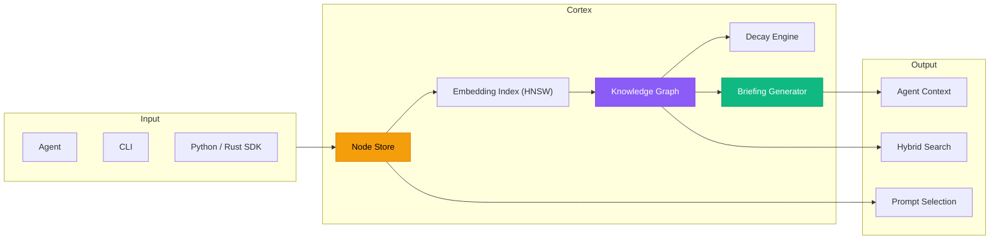

# Hey, I'm Mike 👋

📍 **London, UK** | 🤖 **Lead Backend Engineer** | 🚀 **[darlington.dev](https://darlington.dev)**

> First neural network in 2017. 8 years of backend engineering across regulated industries. Now building autonomous AI agent infrastructure. Targeting 10,000 iterations this year — every decision is training data.

## Cortex

```mermaid
graph LR
    subgraph Input
        Agent1["Agent"]
        CLI["CLI"]
        API["Python / Rust SDK"]
    end

    subgraph Cortex
        Store["Node Store"]
        Embed["Embedding Index (HNSW)"]
        Graph["Knowledge Graph"]
        Decay["Decay Engine"]
        Briefing["Briefing Generator"]
    end

    subgraph Output
        Context["Agent Context"]
        Search["Hybrid Search"]
        Prompts["Prompt Selection"]
    end

    Input --> Store
    Store --> Embed --> Graph
    Graph --> Decay
    Graph --> Briefing --> Context
    Graph --> Search
    Store --> Prompts

    style Store fill:#f59e0b,stroke:#d97706,color:#000
    style Graph fill:#8b5cf6,stroke:#7c3aed,color:#fff
    style Briefing fill:#10b981,stroke:#059669,color:#fff
```

**Cortex** — embedded graph memory for AI agents. Agents store knowledge as typed nodes → auto-linking via embeddings → decay of unused knowledge → briefings synthesised on demand → agents get smarter. One binary. One file. Zero dependencies. Currently trialled by 2 startups.

## Services

| Service | Purpose | Repo |
|---------|---------|------|
| **Warren** | Agent lifecycle manager (Docker Swarm) | [Go](https://github.com/MikeSquared-Agency/Warren) |
| **Dispatch** | Task broker — 11-factor scoring, NATS delivery | [Go](https://github.com/MikeSquared-Agency/Dispatch) |
| **Alexandria** | Knowledge layer — secrets, semantic search, context | [Go](https://github.com/MikeSquared-Agency/Alexandria) |
| **PromptForge** | Prompt registry — versioning, branching, subscriptions | [Python](https://github.com/MikeSquared-Agency/PromptForge) |
| **Chronicle** | Observability — transcript storage, DLQ alerts | [Go](https://github.com/MikeSquared-Agency/Chronicle) |
| **MissionControl** | 10-stage orchestration — gates, workers, audit trail | [Go + Rust](https://github.com/MikeSquared-Agency/MissionControl) |
| **Dredd** | The Judge — extracts decisions, builds trust scores | [Go](https://github.com/MikeSquared-Agency/dredd) |
| **CC Sidecar** | Watches Claude Code sessions, publishes to NATS | [Go](https://github.com/MikeSquared-Agency/cc-sidecar) |

## Agents

| Agent | Role |
|-------|------|
| 🦊 **Kai** | King. Orchestrates work, thinks architecturally. Always-on, bare metal. |
| 🌸 **Lily** | PA. Conversational, WhatsApp + Slack. |
| 🔭 **Scout** | Research specialist. Web search, structured reports. |
| ⚒️ **Celebrimbor** | PromptArchitect. Designs and evolves agent personas. |
| ⚔️ **DutyBound** | Developer. Spawned on-demand for code tasks. |
| ⚖️ **Dredd** | Judge. Extracts decisions from transcripts, feeds trust loop. |

## Apps

**[Darlington](https://darlington.dev)** — Personal OS. Habits, health, finance, Mandarin, calendar, Kai chat. Next.js 15 + Supabase.

**[OpenGlass](https://github.com/DarlingtonDeveloper/OpenGlass)** — iOS smart glasses app connecting Meta Ray-Bans to Gemini Live + OpenClaw.

**[Cortex](https://github.com/MikeSquared-Agency/cortex)** — Embedded Rust knowledge graph for agent memory.

## What I'm Currently Doing

- Architecting multi-agent workflows with MCP at Cox Automotive
- Building Cortex — embedded Rust knowledge graph for agent memory, trialled by 2 startups
- Contributing to OpenClaw
- Targeting 10,000 iterations this year

---

---

  
  
  
  

## Recognition

- **Lead Backend Engineer** at Cox Automotive
- Previously **BNY Mellon**, **Finova** (Bain Capital portfolio)
- **First Class Honours**, Computer Science — AI specialisation
- Cortex trialled by 2 startups
- Deployed LLM-powered chatbot at BNY Mellon in 2021, pre-ChatGPT

## Philosophy

> **10,000 iterations, not 10,000 hours.** Every decision is training data. Every conversation teaches the swarm.

Random facts

- Built my first neural network in 2017 during university — a CNN for image classification
- I speak conversational Mandarin and track progress daily on Darlington
- Ran a cricket data analytics side project with Monte Carlo simulations
- I play Old School RuneScape — efficiency-focused, naturally
- My agents have a trust scoring system — they earn autonomy over time
- The name "MikeSquared" comes from a joke about having two Mikes on a team

