# Hey, I'm Mike 👋

Building autonomous AI infrastructure. Currently running a swarm of AI agents that orchestrate work, make decisions, and learn from feedback.

## The Swarm

```mermaid
graph LR
    subgraph Input
        WhatsApp
        Slack
        Web["Web Chat"]
        CC["Claude Code"]
    end

    subgraph Core
        Gateway["OpenClaw Gateway"]
        NATS["Hermes (NATS)"]
    end

    subgraph Agents
        Kai["🦊 Kai — King"]
        Lily["🌸 Lily — PA"]
        Scout["🔭 Scout — Research"]
        Dredd["⚖️ Dredd — Judge"]
    end

    subgraph Learn
        Chronicle["Chronicle"]
        Decisions["Decision Engine"]
        Trust["Trust Scores"]
    end

    Input --> Gateway --> Agents
    Gateway --> NATS --> Chronicle --> Dredd
    Dredd --> Decisions --> Trust
    Trust --> |"feeds back"| Agents

    style Kai fill:#f59e0b,stroke:#d97706,color:#000
    style Dredd fill:#ef4444,stroke:#dc2626,color:#fff
    style NATS fill:#8b5cf6,stroke:#7c3aed,color:#fff
```

**How it works:** Messages come in from any surface → agents respond → every conversation flows through NATS to Chronicle → Dredd extracts decisions → trust scores build up → agents get better over time. The goal is autonomy.

## Services

| Service | Purpose | Repo |
|---------|---------|------|
| **Warren** | Agent lifecycle manager (Docker Swarm) | [Go](https://github.com/MikeSquared-Agency/Warren) |
| **Dispatch** | Task broker — 11-factor scoring, NATS delivery | [Go](https://github.com/MikeSquared-Agency/Dispatch) |
| **Alexandria** | Knowledge layer — secrets, semantic search, context | [Go](https://github.com/MikeSquared-Agency/Alexandria) |
| **PromptForge** | Prompt registry — versioning, branching, subscriptions | [Python](https://github.com/MikeSquared-Agency/PromptForge) |
| **Chronicle** | Observability — transcript storage, DLQ alerts | [Go](https://github.com/MikeSquared-Agency/Chronicle) |
| **MissionControl** | 10-stage orchestration — gates, workers, audit trail | [Go + Rust](https://github.com/MikeSquared-Agency/MissionControl) |
| **Dredd** | The Judge — extracts decisions, builds trust scores | [Go](https://github.com/MikeSquared-Agency/dredd) |
| **CC Sidecar** | Watches Claude Code sessions, publishes to NATS | [Go](https://github.com/MikeSquared-Agency/cc-sidecar) |

## Agents

| Agent | Role |
|-------|------|
| 🦊 **Kai** | King. Orchestrates work, thinks architecturally. Always-on, bare metal. |
| 🌸 **Lily** | PA. Conversational, WhatsApp + Slack. |
| 🔭 **Scout** | Research specialist. Web search, structured reports. |
| ⚒️ **Celebrimbor** | PromptArchitect. Designs and evolves agent personas. |
| ⚔️ **DutyBound** | Developer. Spawned on-demand for code tasks. |
| ⚖️ **Dredd** | Judge. Extracts decisions from transcripts, feeds trust loop. |

## Apps

**[Darlington](https://darlington.dev)** — Personal OS. Habits, health, finance, Mandarin, calendar, Kai chat. Next.js 15 + Supabase.

**[OpenGlass](https://github.com/DarlingtonDeveloper/OpenGlass)** — iOS app connecting Meta Ray-Ban glasses to Gemini Live + OpenClaw.

## Philosophy

**10,000 iterations, not 10,000 hours.** Every decision is training data. Every conversation teaches the swarm.

## Tech

`Go` `TypeScript` `Rust` `Python` `Swift` `Next.js` `Supabase` `Docker Swarm` `NATS` `pgvector`

---

  

  

  🌐 <a href="https://darlington.dev">darlington.dev</a>

