# Hey, I'm Mike 👋

Building autonomous AI infrastructure. Currently running a swarm of AI agents that orchestrate work, make decisions, and learn from feedback.

## The Swarm

```mermaid
graph LR
    subgraph Surfaces["💬 Surfaces"]
        WA["WhatsApp"]
        Slack["Slack"]
        Web["Web Chat"]
        CC["Claude Code"]
    end

    subgraph Gateway["🚪 Gateway"]
        OC["OpenClaw"]
        Hook["NATS Hook"]
        Sidecar["CC Sidecar"]
    end

    subgraph Agents["🤖 Agents"]
        Kai["🦊 Kai"]
        Lily["🌸 Lily"]
        Scout["🔭 Scout"]
        Celebrimbor["⚒️ Celebrimbor"]
        DutyBound["⚔️ DutyBound"]
        Dredd["⚖️ Dredd"]
    end

    subgraph Bus["📡 Message Bus"]
        Hermes["Hermes · NATS"]
    end

    subgraph Services["⚙️ Services"]
        Warren["Warren · Agent Manager"]
        Dispatch["Dispatch · Task Broker"]
        Alexandria["Alexandria · Knowledge"]
        PromptForge["PromptForge · Prompts"]
        Chronicle["Chronicle · Observability"]
        MC["MissionControl · Orchestration"]
    end

    WA & Slack & Web --> OC
    CC --> Sidecar

    OC --> Agents
    OC --> Hook --> Hermes
    Sidecar --> Hermes

    Hermes --> Chronicle
    Chronicle --> Dredd

    Dispatch --> Warren --> Agents
    Alexandria --> Agents
    PromptForge --> Agents
    Kai --> MC
    Kai --> Dispatch

    Dredd --> PromptForge
    Dredd --> Dispatch

    style Kai fill:#f59e0b,stroke:#d97706,color:#000
    style Dredd fill:#ef4444,stroke:#dc2626,color:#fff
    style Hermes fill:#8b5cf6,stroke:#7c3aed,color:#fff
    style Warren fill:#3b82f6,stroke:#2563eb,color:#fff
    style Dispatch fill:#10b981,stroke:#059669,color:#fff
```

## Infrastructure

| Service | What it does | Stack | Repo |
|---------|-------------|-------|------|
| **[Warren](https://github.com/MikeSquared-Agency/Warren)** | Reverse proxy managing agents in Docker Swarm. Hostname routing, lifecycle policies, wake-on-demand. | Go | [→](https://github.com/MikeSquared-Agency/Warren) |
| **[Dispatch](https://github.com/MikeSquared-Agency/Dispatch)** | Task broker. 11-factor scoring, capability matching, owner-scoped assignment, NATS delivery. | Go | [→](https://github.com/MikeSquared-Agency/Dispatch) |
| **[Alexandria](https://github.com/MikeSquared-Agency/Alexandria)** | Knowledge layer. Secrets vault, semantic search, knowledge graph, context endpoint, access control. | Go + pgvector | [→](https://github.com/MikeSquared-Agency/Alexandria) |
| **[PromptForge](https://github.com/MikeSquared-Agency/PromptForge)** | Prompt lifecycle management. Registry, versioning, branching, subscriptions, composition engine. | Python/FastAPI | [→](https://github.com/MikeSquared-Agency/PromptForge) |
| **[Chronicle](https://github.com/MikeSquared-Agency/Chronicle)** | Observability. NATS event consumer, transcript storage, DLQ alerts, batch writes to Supabase. | Go | [→](https://github.com/MikeSquared-Agency/Chronicle) |
| **[MissionControl](https://github.com/MikeSquared-Agency/MissionControl)** | 10-stage agentic orchestration. Gate validation, worker tracking, WebSocket hub, OpenClaw bridge. | Go + Rust | [→](https://github.com/MikeSquared-Agency/MissionControl) |
| **[Hermes](https://github.com/MikeSquared-Agency/swarm-dlq)** | NATS + JetStream message bus. Pub/sub, durable streams, inter-agent coordination. | NATS 2.12 | — |
| **[Slack Gateway](https://github.com/MikeSquared-Agency/slack-gateway)** | Routes Slack events into OpenClaw gateway sessions. Socket Mode, workspace routing. | Go | [→](https://github.com/MikeSquared-Agency/slack-gateway) |
| **[Gateway NATS Hook](https://github.com/MikeSquared-Agency/gateway-nats-hook)** | OpenClaw hook publishing session transcript chunks to NATS for the decision pipeline. | TypeScript | [→](https://github.com/MikeSquared-Agency/gateway-nats-hook) |
| **[CC Sidecar](https://github.com/MikeSquared-Agency/cc-sidecar)** | Watches Claude Code JSONL transcripts, publishes session events to NATS. | Go | [→](https://github.com/MikeSquared-Agency/cc-sidecar) |
| **[Dredd](https://github.com/MikeSquared-Agency/dredd)** | The Judge. Extracts decisions and reasoning patterns from transcripts. Feeds trust scores and prompt evolution. | Go | [→](https://github.com/MikeSquared-Agency/dredd) |

## Agents

| Agent | Role | Always-on |
|-------|------|-----------|
| 🦊 **Kai** | King of the swarm. Orchestrates work, reviews output, thinks architecturally. | ✅ Bare metal |
| 🌸 **Lily** | PA for Mike A. Conversational, Slack + WhatsApp. | ✅ Container |
| 🔭 **Scout** | Research specialist. Web search, analysis, structured reports. | ✅ Container |
| ⚒️ **Celebrimbor** | The PromptArchitect. Designs and evolves agent personas via PromptForge. | ✅ Container |
| ⚔️ **DutyBound** | Developer agent. Spawned as sub-agent for code tasks. | On-demand |
| ⚖️ **Dredd** | The Judge. Processes transcripts, extracts decisions, builds trust scores. | ✅ Container |

## The Decision Pipeline

```mermaid
graph LR
    A["Conversation happens"] --> B["Chronicle stores transcript"]
    B --> C["Dredd extracts decisions"]
    C --> D["Posts to Slack #decisions"]
    D --> E["Human reacts 👍/👎"]
    E --> F["Trust scores update"]
    E --> G["Prompts evolve"]
    E --> H["Dispatch adjusts scoring"]
    F & G & H --> I["System behaviour changes"]
    I --> J["Less human involvement"]
    J --> K["Autonomy"]
```

## Apps

**[Darlington](https://darlington.dev)** — Personal OS. Habits, health, finance, Mandarin practice, calendar, Kai chat, MC dashboard. Next.js 15 + Supabase.

**[OpenGlass](https://github.com/DarlingtonDeveloper/OpenGlass)** — Swift iOS app connecting Meta Ray-Ban glasses to Gemini Live + OpenClaw. 6 modes, real-time AI companion.

## The Philosophy

**10,000 iterations, not 10,000 hours.** Ship → learn → repeat.

Solve your own problems. Ship them publicly. Let volume beat perfection.

Every decision is training data. Every conversation teaches the swarm. The goal is agents that think like you — then surpass you.

## Tech

`TypeScript` `Go` `Rust` `Python` `Swift` `Next.js` `React` `Supabase` `Docker Swarm` `NATS` `pgvector` `Node.js`

## Stats

## Find Me

🌐 [darlington.dev](https://darlington.dev) · 🐦 [@mikedarlington_](https://twitter.com/mikedarlington_)
